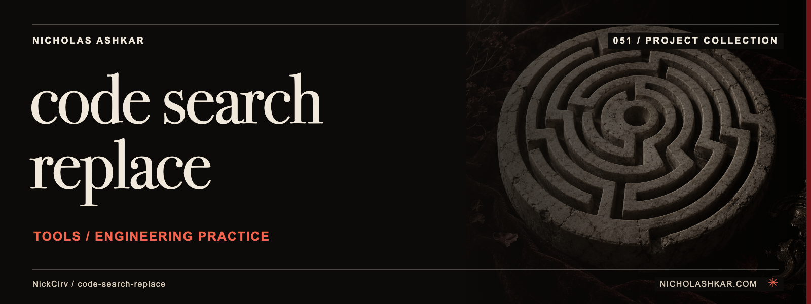

# code-search-replace

Searches and replaces matching text across files with previews and local undo data.


<a id="usage"></a>

## What it does

- Literal/regex search.
- Case and word controls.
- Interactive review.
- Dry-run diffs.
- Local history and undo.


<a id="install"></a>

## Quickstart

Prerequisites: Node.js `>=20` and npm. The checkout below pins the source used for this documentation.

```sh
git clone https://github.com/NickCirv/code-search-replace.git
cd code-search-replace
git checkout bd9a537f07bf1a7449f08a222d0b7bd4c9d89770
node index.js "TODO" "NEXT" "**/*.js" --dry-run
```

**Expected behavior (illustrative, not captured):** Displays proposed replacements without applying them.

Examples are source-inspected, **not runtime-tested**. See the research record for verification gaps.

## Boundaries and data

Replacement and undo commands write files. Regex and glob handling use the tool's own parsers; preview the exact match set and keep version-control backups.

## Development

The manifest defines `npm test` as:

```sh
node --test
```

The captured suite is a smoke check, not end-to-end behavior coverage. Examples include “entry is valid JavaScript”. Tests were not run for this documentation revision.

See [implementation and command reference](docs/REFERENCE.md) for the package scripts and inspected interfaces, and [research record](docs/RESEARCH.md) for the pinned source, document decisions and unresolved checks.

## License and contact

See [LICENSE](LICENSE) for the original terms and attribution. Legal text is unchanged.

[Nicholas Ashkar](https://nicholashkar.com/) · [Discuss a project](https://nicholashkar.com/#oxblood-contact)
